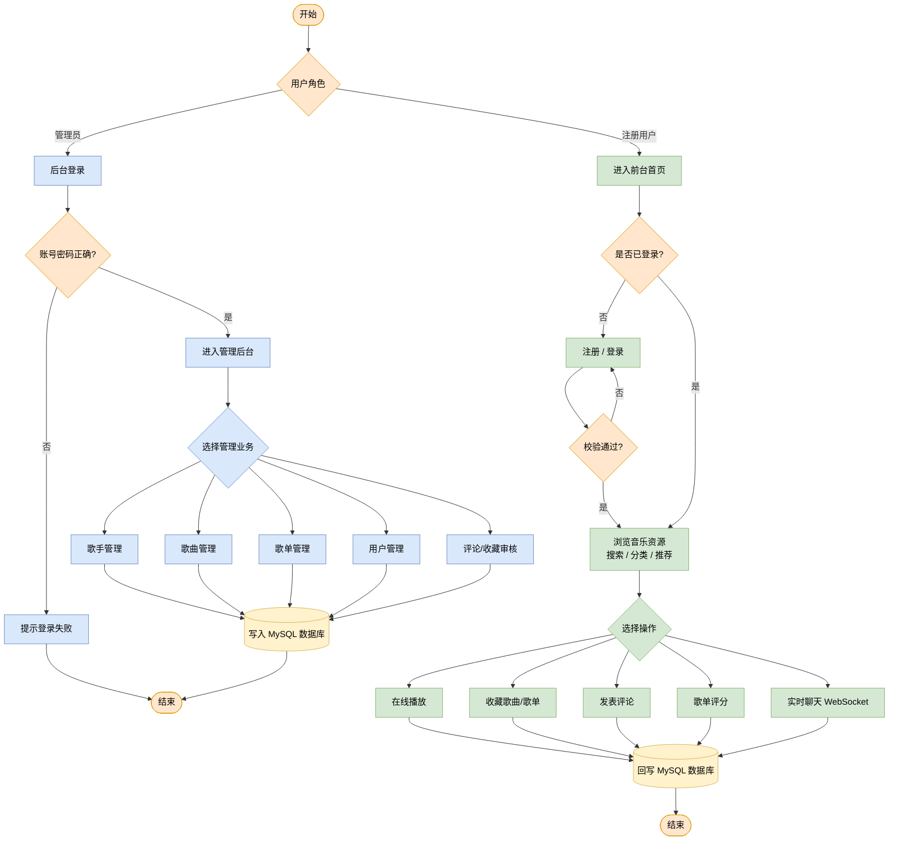

```mermaid
flowchart TD
    classDef admin fill:#DAE8FC,stroke:#6C8EBF,color:#000
    classDef user  fill:#D5E8D4,stroke:#82B366,color:#000
    classDef sys   fill:#FFE6CC,stroke:#D79B00,color:#000
    classDef db    fill:#FFF2CC,stroke:#D6B656,color:#000

    Start([开始])
    Start --> Role{用户角色}

    %% 管理员分支
    Role -->|管理员| AdminLogin[后台登录]
    AdminLogin --> AdminAuth{账号密码正确?}
    AdminAuth -->|否| AdminFail[提示登录失败]
    AdminFail --> EndA([结束])
    AdminAuth -->|是| AdminHome[进入管理后台]
    AdminHome --> AdminPick{选择管理业务}
    AdminPick --> M1[歌手管理]
    AdminPick --> M2[歌曲管理]
    AdminPick --> M3[歌单管理]
    AdminPick --> M4[用户管理]
    AdminPick --> M5[评论/收藏审核]
    M1 & M2 & M3 & M4 & M5 --> WriteDB[(写入 MySQL 数据库)]
    WriteDB --> EndA

    %% 用户分支
    Role -->|注册用户| UserEnter[进入前台首页]
    UserEnter --> UserAuth{是否已登录?}
    UserAuth -->|否| Reg[注册 / 登录]
    Reg --> UCheck{校验通过?}
    UCheck -->|否| Reg
    UCheck -->|是| Browse
    UserAuth -->|是| Browse[浏览音乐资源<br/>搜索 / 分类 / 推荐]
    Browse --> UPick{选择操作}
    UPick --> Op1[在线播放]
    UPick --> Op2[收藏歌曲/歌单]
    UPick --> Op3[发表评论]
    UPick --> Op4[歌单评分]
    UPick --> Op5[实时聊天 WebSocket]
    Op1 & Op2 & Op3 & Op4 & Op5 --> WriteDB2[(回写 MySQL 数据库)]
    WriteDB2 --> EndU([结束])

    class AdminLogin,AdminHome,AdminPick,M1,M2,M3,M4,M5,AdminFail admin
    class UserEnter,Browse,Reg,UPick,Op1,Op2,Op3,Op4,Op5 user
    class Start,EndA,EndU,Role,AdminAuth,UserAuth,UCheck sys
    class WriteDB,WriteDB2 db
```