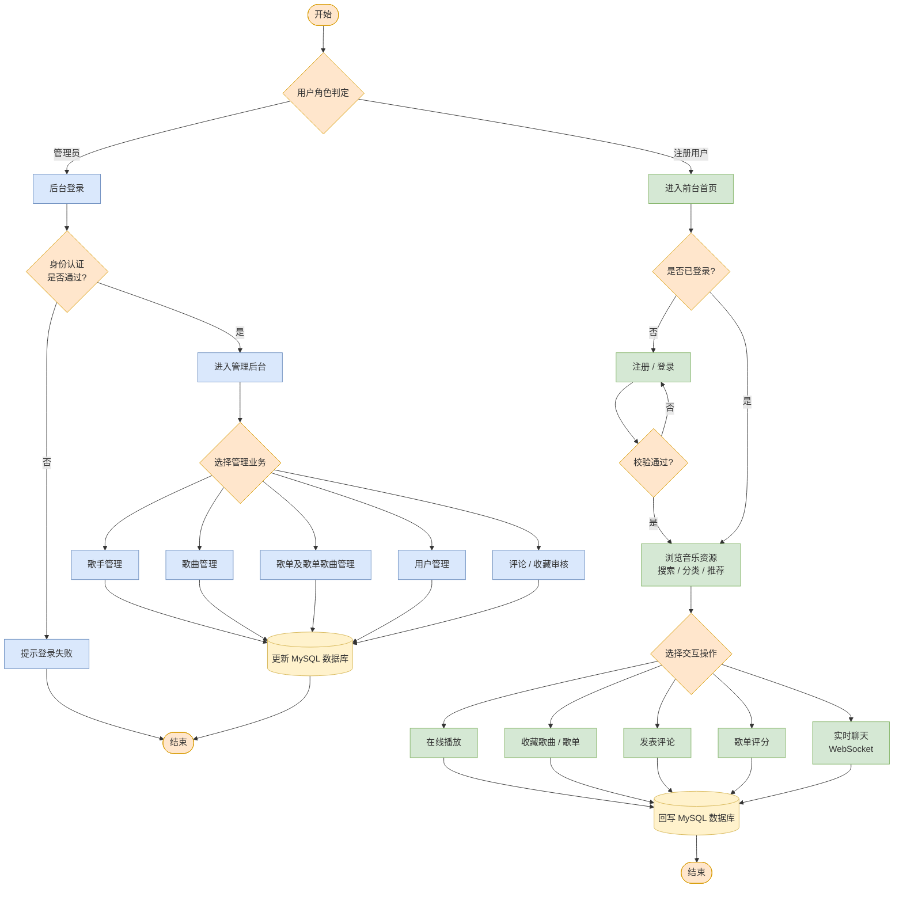

```mermaid
flowchart TD
    classDef admin fill:#DAE8FC,stroke:#6C8EBF
    classDef user  fill:#D5E8D4,stroke:#82B366
    classDef sys   fill:#FFE6CC,stroke:#D79B00
    classDef db    fill:#FFF2CC,stroke:#D6B656

    Start([开始]):::sys --> Role{用户角色判定}:::sys

    %% 管理员分支
    Role -->|管理员| AL[后台登录]:::admin
    AL --> AA{身份认证<br/>是否通过?}:::sys
    AA -->|否| AF[提示登录失败]:::admin --> EndA([结束]):::sys
    AA -->|是| AH[进入管理后台]:::admin --> AP{选择管理业务}:::sys
    AP --> M1[歌手管理]:::admin
    AP --> M2[歌曲管理]:::admin
    AP --> M3[歌单及歌单歌曲管理]:::admin
    AP --> M4[用户管理]:::admin
    AP --> M5[评论 / 收藏审核]:::admin
    M1 & M2 & M3 & M4 & M5 --> WA[(更新 MySQL 数据库)]:::db --> EndA

    %% 用户分支
    Role -->|注册用户| UE[进入前台首页]:::user --> UA{是否已登录?}:::sys
    UA -->|否| Reg[注册 / 登录]:::user --> UC{校验通过?}:::sys
    UC -->|否| Reg
    UC -->|是| Br[浏览音乐资源<br/>搜索 / 分类 / 推荐]:::user
    UA -->|是| Br
    Br --> UP{选择交互操作}:::sys
    UP --> O1[在线播放]:::user
    UP --> O2[收藏歌曲 / 歌单]:::user
    UP --> O3[发表评论]:::user
    UP --> O4[歌单评分]:::user
    UP --> O5[实时聊天<br/>WebSocket]:::user
    O1 & O2 & O3 & O4 & O5 --> WU[(回写 MySQL 数据库)]:::db --> EndU([结束]):::sys
```