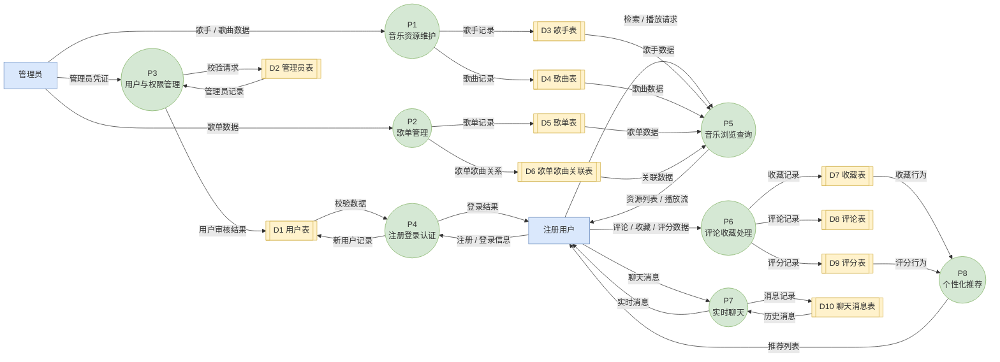

```mermaid
flowchart LR
    classDef ent  fill:#DAE8FC,stroke:#6C8EBF
    classDef proc fill:#D5E8D4,stroke:#82B366
    classDef db   fill:#FFF2CC,stroke:#D6B656

    Admin[管理员]:::ent
    User[注册用户]:::ent

    P1((P1<br/>音乐资源维护)):::proc
    P2((P2<br/>歌单管理)):::proc
    P3((P3<br/>用户与权限管理)):::proc
    P4((P4<br/>注册登录认证)):::proc
    P5((P5<br/>音乐浏览查询)):::proc
    P6((P6<br/>评论收藏处理)):::proc
    P7((P7<br/>实时聊天)):::proc
    P8((P8<br/>个性化推荐)):::proc

    D1[[D1 用户表]]:::db
    D2[[D2 管理员表]]:::db
    D3[[D3 歌手表]]:::db
    D4[[D4 歌曲表]]:::db
    D5[[D5 歌单表]]:::db
    D6[[D6 歌单歌曲关联表]]:::db
    D7[[D7 收藏表]]:::db
    D8[[D8 评论表]]:::db
    D9[[D9 评分表]]:::db
    D10[[D10 聊天消息表]]:::db

    %% 管理员侧
    Admin -- 管理员凭证 --> P3
    P3 -- 校验请求 --> D2
    D2 -- 管理员记录 --> P3
    P3 -- 用户审核结果 --> D1

    Admin -- 歌手 / 歌曲数据 --> P1
    P1 -- 歌手记录 --> D3
    P1 -- 歌曲记录 --> D4

    Admin -- 歌单数据 --> P2
    P2 -- 歌单记录 --> D5
    P2 -- 歌单歌曲关系 --> D6

    %% 用户侧
    User -- 注册 / 登录信息 --> P4
    P4 -- 新用户记录 --> D1
    D1 -- 校验数据 --> P4
    P4 -- 登录结果 --> User

    User -- 检索 / 播放请求 --> P5
    D3 -- 歌手数据 --> P5
    D4 -- 歌曲数据 --> P5
    D5 -- 歌单数据 --> P5
    D6 -- 关联数据 --> P5
    P5 -- 资源列表 / 播放流 --> User

    User -- 评论 / 收藏 / 评分数据 --> P6
    P6 -- 评论记录 --> D8
    P6 -- 收藏记录 --> D7
    P6 -- 评分记录 --> D9

    User -- 聊天消息 --> P7
    P7 -- 消息记录 --> D10
    D10 -- 历史消息 --> P7
    P7 -- 实时消息 --> User

    D7 -- 收藏行为 --> P8
    D9 -- 评分行为 --> P8
    P8 -- 推荐列表 --> User
```